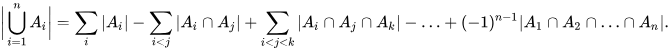

# Brainfuck. Транслятор и модель

- Студент: Зайцев Артём Михайлович
- Преподаватели, Пенской Александр Владимирович.
- `asm | acc | harv | mc -> hw | tick -> instr | struct | stream | port | pstr | prob1 | cache`
- Базовый вариант.

## Язык программирования

Используется форма БНФ

`N` - любое число вмещающееся в int64

`text` - символьный текст состоящий из букв и цифр
`comment` - символьный текст без переноса строк

``` ebnf
program ::= <оператор> | <метка>

<метка> ::= "text:" <данные>| "text:" <данные> <комментарий> |
            "text:" <оператор> | "text:" <оператор> <комментарий>
<данные> ::= <число> | <резерв> | <текст>

<число> :: "0xN"
<резерв> :: "(0xN)"
<текст> :: '"text"'

<оператор> ::= <оп_код> <аргументы> | <оп_код> <аргументы> <комментарий>
<комментарий> ::= "//comment"
<оп_код> ::= "inc" | "dec" | "cls" | "neg" | "load" | "store" | "add" | "sub" |
            "jmp" | "jmpz" | "input" | "output" | "hlt" | "inp" | "outp"
<аргументы> ::= <литерал> |
                <прямая адресация> | 
                <загрузка адреса метки> |
                <косвенная адресация>
<литерал> ::= "0xN"
<прямая адресация> ::= "label"
<загрузка адреса ссылки> ::= "&label"
<косвенная адресация> ::= "(label)"

```

Код выполняется последовательно. С учётом команд ветвлений

Операции:

См. в разделе "Система команд" -> "Набор инструкций"

Любые другие символы в строке после `//` трактуются как комментарии

Память выделяется статически, при запуске модели.
Видимость данных -- глобальная.
Поддержка литералов -- присутствует (описана в следующем разделе).

## Организация памяти

[//]: # (TODO registers list)

[//]: # (TODO other qustions from doc)

Модель памяти процессора Гарвардская (отдельная память для команд и данных):

1. Память команд. Машинное слово -- не определено. Реализуется списком словарей, описывающих инструкции (одно слово --
   одна ячейка).
2. Память данных. Машинное слово -- 64 бит, знаковое. Линейное адресное пространство. Реализуется списком чисел.

Адресация:

| name  | code    | desc                     |
|-------|---------|--------------------------|
| dir   | 0xN     | Прямая загрузка литерала |
| addr  | &label  | Загрузка адреса метки    |
| val   | label   | Прямая адресация         |
| indir | (label) | Косвенная адресация      |
| no    | _       | Без операнда             |

Вложенный типы адресации запрещены. Пример: `((label))`, `(&label)`

Механика отображения *данных* на процессор:

- После того как транслятор обработал исходный код в память данных последовательно загружаются данные в виде массива
  целых
  чисел.
- Если при выделении памяти было использовано больше 1 ячейки, то перед данным в памяти пишется их количество.

Механика отображения *команд* на процессор:

- Все литералы, адреса меток хранятся в памяти команд вместе с инструкциями
- Так же типы адресации хранятся в памяти команд вместе с инструкциями

- Ячейки памяти данных могут и должны использоваться в качестве переменных

- В текущей реализации константы отсутствуют

- Работа с переменными происходит за счёт работы с памятью данных через метки
- Список словарей копируется в память команд.

Выделять память можно 3 способами

1) ввод значения (число или один символ)
2) резерв на заданное количество ячеек
3) Ввод строки из символов

Все символы заменяются на ascii коды.
Во 2 и 3 пунктах перед данными в память пишется количество занятых ячеек

## Система команд

Особенности процессора:

- Машинное слово -- 64 бит, знаковое.
- Доступ к памяти данных осуществляется по адресу, хранящемуся в специальном регистре `data_address`.
  В данный регистр загружается значение аргумента.
  При косвенной адресации после этого в `data_address` загружается значение памяти текущей ячейки.
  Программисту напрямую он не доступен. Запись `acc` в память и чтение данных из памяти в `acc` осуществляется с помощью
  команд `load`, `store` соответственно.
- Обработка данных осуществляется по текущему адресу операциями АЛУ.
- Поддерживается ввод/вывод данных через соответственные буферы. Команды `input`, `output`.
    - Поддерживается ввод и вывод в 2 дополнительных порта. Команды `inp`, `outp`.
- Поток управления:
    - инкремент `PC` после каждой инструкции;
    - условный (`jmpz`) и безусловный (`jmp`) переходы (использование см. в разделе транслятор).

### Набор инструкций

| op_code | типы адресации        | Мнемоника             |
|---------|-----------------------|-----------------------|
| inc     | no                    | acc++                 |
| dec     | no                    | acc--                 |
| cls     | no                    | acc <- 0              |
| neg     | no                    | acc <- -acc           |
| load    | dir, addr, val, indir | acc <- mem            |
| store   | val, indir            | mem <- acc            |
| add     | val, dir              | acc += i              |
| sub     | val, dir              | acc -=i               |
| jmp     | i_val                 | IP <- arg             |
| jmpz    | i_val                 | IP <- arg (if z_flag) |
| input   | no                    | read from buffer      |
| output  | no                    | write to buffer       |
| hlt     | no                    | stop                  |
| inp     | dir                   | input from port       |
| outp    | dir                   | output to port        |

### Кодирование инструкций

- Машинный код сериализуется в список JSON.
- Один элемент списка -- одна инструкция.
- Индекс списка -- адрес инструкции. Используется для команд перехода.
- В регистр `IR` попадает закодированная инструкция по следующей формуле: `<op_code_id> * 10 + <address_type_id>`

Пример:

```json
{
  "code": [
    {
      "opcode": "add",
      "arg": 5,
      "address_type": "direct_addr",
      "term": [
        1,
        "add 0x5"
      ]
    }
  ]
}
```

где:

- `opcode` -- строка с кодом операции;
- `arg` -- аргумент (знаковое число);
- `address_type` -- Тип адресации;
- `term` -- информация о связанном месте в исходном коде. Номер и текст строки

Типы данных в модуле [isa](./isa.py), где:

- `Opcode` -- перечисление кодов операций;
- `Address` -- перечисление типов адресации.
- `operation_to_code` -- кодирование операции и адресации в число.
- `code_to_operation` -- декодирование операции и адресации из числа.

В словаре `allowed_addressing` для каждой команды хранятся разрешённые типы адресации

## Транслятор

Интерфейс командной строки: `translator.py <input_file> <target_file>`

Реализовано в модуле: [translator](./translator.py)

Этапы трансляции (функция `translate`):

1. Очистка кода: избавление от отступов, комментариев, пустых строк
2. Генерация блока данных и инструкций. Сохранение адресов меток
3. Подстановка адресов меток в инструкции

Правила генерации машинного кода:

- один строка языка -- одна инструкция;
- для всех команд прямое отображение;
- Все символы в строке после `//` считаются комментариями и не учитываются при генерации кода
- Между `opcode` и аргументом должен быть ровно 1 пробел
- После метки через `": "` сразу должна идти либо инструкция, либо выделение памяти
- Секция данных начинается со строки `section .data`
- Затем идёт секция кода, которая начинается со строки `section .code`

## Модель процессора

### DataPath


Реализован в модуле: [Datapath](./data_path.py).

`data_memory` -- однопортовая память, поэтому либо читаем, либо пишем.
`instuction_memory` -- однопортовая память, поэтому либо читаем, либо пишем.

Сигналы (обрабатываются за один такт, реализованы в виде методов класса):

- `get_instruction_signal` -- поместить выбранную инструкцию из регистра `IP` на шину `IR`
- `do_alu_signal` -- сигнал на выполнение АЛУ операции и выставление результатов на шину аккумулятора
- `get_data_signal` -- поместить выбранную ячейку из регистра `ADDR` на шину аргумента АЛУ и `ADDR`
- `set_data_signal` -- записать в память данных значение `acc` по адресу из `ADDR`
- `latch_reg_ip_signal` -- защелкнуть регистр `IP`
- `latch_reg_ir_signal` -- защелкнуть регистр `IR`
- `latch_reg_addr_signal` -- защелкнуть регистр `ADDR`
- `set_mux_jmp_type` -- установка мультиплексора на тип перехода: 0 - обычный переход, 1 - 1 - `Z_flag`
- `set_mux_ip_signal` -- установка мультиплексора на `IP`: 0 - из операнда инструкции, 1 - `IP+1`
- `set_mux_addr_signal` -- установка мультиплексора на `ADDR`: 1 - операнда инструкции; 0 - из выхода памяти
- `set_mux_alu_signal` -- установка верхнего мультиплексора на ввод АЛУ: 0 - операнда инструкции; 1 - значение шины из
  памяти данных
- `set_mux_alu_input_signal` -- установка нижнего мультиплексора на ввод АЛУ
  0 - верхний мультиплексор; 1 - `input_buffer`; 2, 3 - ввод из портов 1 и 2 соответственно. (работа с буферами
  реализована на Python)
- `latch_acc_signal` -- защелкнуть значение аккумулятора и выставить флаг `Z_flag`
- `output_signal` -- записать аккумулятор в порт вывода (обработка на Python)
- `port_1_signal` -- записать аккумулятор в порт вывода для устройства 1
- `port_2_signal` -- записать аккумулятор в порт вывода для устройства 2

Флаги:

- `Z_flag` -- отражает наличие нулевого значения в аккумуляторе.

### ControlUnit


Реализован в классе в модуле: [ControlUnit](./control_unit.py).
Сигналы:

- `set_MUX` - установка мультиплексора на `IP`: 0 - запись 0 в `IP`, 1 - `IP+1`, 2 - запись значения из декодера в `IP`
- `latch_IP` - защелкнуть `IP`

Функции

- `decode` -- преобразовать код инструкции в адрес в памяти микрокоманд
- `load_mem` -- загрузить память микрокоманд
- `execute` -- выполнение микрокода: каждый "бит" (1/0 в массиве микрокоманды) связан с функцией, которая вызывается,
  передавая в аргумент значение бита (0 - выполняется; 1 - не выполняется)
- `juggernaut` -- **молотить** (выполнять) микроинструкции.

Особенности работы модели:

- Цикл симуляции осуществляется в функции `juggernaut`.
- Шаг моделирования соответствует одной микроинструкции с инкрементированием счётчика `tick`.
- Для журнала состояний процессора используется стандартный модуль `logging`.
- Остановка моделирования осуществляется при:
    - исключении `EmptyBufferError` -- если нет данных для чтения из порта ввода;
    - исключении `HltError` -- если выполнена инструкция `halt`.

### Микропрограммное управление

#### Кoдирование инструкций

Само кодирование инструкций описано в модуле [mc_consts.py](mc_consts.py)

В *bit_dict* задаётся значение для каждого бита. Также там задаются заглушки,
которые позволяют не изменять предыдущее значение. Но на стадии генерации микрокода эти заглушки заменяются
реальными значениями.

Затем для каждого типа команд идёт описание, того, какие сигналы нужно подавать. В конце каждой команды всегда
отсутствует сигнал `M_MUX_IP`. Тк нам нужно регистр микроинструкций вернуть в 0 положение для следующей команды.
Так же каждая микроинструкция сопровождается `M_IP`, тк нам каждый раз нужно переходить к следующей микроиструкции.

Операции `inc`, `dec`, `add`, `sub`, `cls`, `neg`, `load` объединены в одну группу АЛУ операций,
тк в схеме мы из `IR` передаём закодированное значение инструкции сразу в АЛУ. И оно, при получении сигнала, выполняет
нужны операции.

Затем в `op_dict` задаётся микрокод для каждой команды.

Затем в том же стиле описываются типы адресации.

#### Генерация памяти микрокоманд

Генерация памяти мк описано в модуле [mc_generator.py](mc_generator.py)

Сначала мы генерируем команду `START`, которая позволяет декодеру выбрать нужный блок микрокоманд.

Затем мы для каждой разрешённой комбинации адресация + команда генерируем мк и последовательно добавляем в итоговый
массив.
Также запоминаем, адрес добавления, чтобы потом декодер мог понять, где лежит нужный блок.

Функция `_labels_to_bits` как раз отвечает за линии сигналов из изложенного выше формата.
Тут она преобразует описание мк в массив чисел 0, 1, (2, 3). Значения 2 и 3 нужны для 2 мультиплексоров.

В результате у нас получается матрица 33x17. Всего 33 микрокоманды по 17 сигналов.

<details>
  <summary>Кодирование команд</summary>

##### `START`

| IP | IM | MUX_IP | MUX_JMP_TYPE | IR | MUX_ADDR | ADDR | MUX_ALU | MUX_ALU_INPUT | ALU | ACC | OUTPUT | DIN | DOUT |
M_MUX_IP | M_IP | PORT1_OUT | PORT2_OUT |
|----|--------|--------------|----|----------|------|---------|---------------|-----|-----|--------|-----|------|----------|------|-----------|-----------|
| 1 | 0 | 0 | 1 | 0 | 0 | 0 | 0 | 0 | 0 | 0 | 0 | 0 | 2 | 1 | 0 | 0 |

##### `INC`, `DEC`, `ADD`, `SUB`, `CLS`, `NEG`, `LOAD`

| IP | IM | MUX_IP | MUX_JMP_TYPE | IR | MUX_ADDR | ADDR | MUX_ALU | MUX_ALU_INPUT | ALU | ACC | OUTPUT | DIN | DOUT |
M_MUX_IP | M_IP | PORT1_OUT | PORT2_OUT |
|----|--------|--------------|----|----------|------|---------|---------------|-----|-----|--------|-----|------|----------|------|-----------|-----------|
| 0 | 1 | 0 | 0 | -1 | 0 | -1 | -1 | 1 | 1 | 0 | 0 | 0 | 0 | 1 | 0 | 0 |

##### `STORE`

| IP | IM | MUX_IP | MUX_JMP_TYPE | IR | MUX_ADDR | ADDR | MUX_ALU | MUX_ALU_INPUT | ALU | ACC | OUTPUT | DIN | DOUT |
M_MUX_IP | M_IP | PORT1_OUT | PORT2_OUT |
|----|--------|--------------|----|----------|------|---------|---------------|-----|-----|--------|-----|------|----------|------|-----------|-----------|
| 0 | 1 | 0 | 0 | -1 | 0 | -1 | -1 | 0 | 0 | 0 | 1 | 0 | 0 | 1 | 0 | 0 |

##### `JMP`

| IP | IM | MUX_IP | MUX_JMP_TYPE | IR | MUX_ADDR | ADDR | MUX_ALU | MUX_ALU_INPUT | ALU | ACC | OUTPUT | DIN | DOUT |
M_MUX_IP | M_IP | PORT1_OUT | PORT2_OUT |
|----|--------|--------------|----|----------|------|---------|---------------|-----|-----|--------|-----|------|----------|------|-----------|-----------|
| 0 | 0 | 0 | 0 | -1 | 0 | -1 | -1 | 0 | 0 | 0 | 0 | 0 | 0 | 1 | 0 | 0 |

##### `JMPZ`

| IP | IM | MUX_IP | MUX_JMP_TYPE | IR | MUX_ADDR | ADDR | MUX_ALU | MUX_ALU_INPUT | ALU | ACC | OUTPUT | DIN | DOUT |
M_MUX_IP | M_IP | PORT1_OUT | PORT2_OUT |
|----|--------|--------------|----|----------|------|---------|---------------|-----|-----|--------|-----|------|----------|------|-----------|-----------|
| 0 | 0 | 1 | 0 | -1 | 0 | -1 | -1 | 0 | 0 | 0 | 0 | 0 | 0 | 1 | 0 | 0 |

##### `INPUT`

| IP | IM | MUX_IP | MUX_JMP_TYPE | IR | MUX_ADDR | ADDR | MUX_ALU | MUX_ALU_INPUT | ALU | ACC | OUTPUT | DIN | DOUT |
M_MUX_IP | M_IP | PORT1_OUT | PORT2_OUT |
|----|--------|--------------|----|----------|------|---------|---------------|-----|-----|--------|-----|------|----------|------|-----------|-----------|
| 0 | 1 | 0 | 0 | -1 | 0 | -1 | 1 | 1 | 1 | 0 | 0 | 0 | 0 | 1 | 0 | 0 |

##### `PORT1_IN`

| IP | IM | MUX_IP | MUX_JMP_TYPE | IR | MUX_ADDR | ADDR | MUX_ALU | MUX_ALU_INPUT | ALU | ACC | OUTPUT | DIN | DOUT |
M_MUX_IP | M_IP | PORT1_OUT | PORT2_OUT |
|----|--------|--------------|----|----------|------|---------|---------------|-----|-----|--------|-----|------|----------|------|-----------|-----------|
| 0 | 1 | 0 | 0 | -1 | 0 | -1 | 2 | 1 | 1 | 0 | 0 | 0 | 0 | 1 | 0 | 0 |

##### `PORT2_IN`

| IP | IM | MUX_IP | MUX_JMP_TYPE | IR | MUX_ADDR | ADDR | MUX_ALU | MUX_ALU_INPUT | ALU | ACC | OUTPUT | DIN | DOUT | M_MUX_IP | M_IP | PORT1_OUT | PORT2_OUT |
|----|----|--------|--------------|----|----------|------|---------|---------------|-----|-----|--------|-----|------|----------|------|-----------|-----------|
| 0  | 0  | 1      | 0            | 0  | -1       | 0    | -1      | 3             | 1   | 1   | 0      | 0   | 0    | 0        | 1    | 0         | 0         |

##### `OUTPUT`

| IP | IM | MUX_IP | MUX_JMP_TYPE | IR | MUX_ADDR | ADDR | MUX_ALU | MUX_ALU_INPUT | ALU | ACC | OUTPUT | DIN | DOUT | M_MUX_IP | M_IP | PORT1_OUT | PORT2_OUT |
|----|----|--------|--------------|----|----------|------|---------|---------------|-----|-----|--------|-----|------|----------|------|-----------|-----------|
| 0  | 0  | 1      | 0            | 0  | -1       | 0    | -1      | -1            | 0   | 0   | 1      | 0   | 0    | 0        | 1    | 0         | 0         |

##### `PORT1_OUT`

| IP | IM | MUX_IP | MUX_JMP_TYPE | IR | MUX_ADDR | ADDR | MUX_ALU | MUX_ALU_INPUT | ALU | ACC | OUTPUT | DIN | DOUT | M_MUX_IP | M_IP | PORT1_OUT | PORT2_OUT |
|----|----|--------|--------------|----|----------|------|---------|---------------|-----|-----|--------|-----|------|----------|------|-----------|-----------|
| 0  | 0  | 1      | 0            | 0  | -1       | 0    | -1      | -1            | 0   | 0   | 0      | 0   | 0    | 0        | 1    | 1         | 0         |

##### `PORT2_OUT`

| IP | IM | MUX_IP | MUX_JMP_TYPE | IR | MUX_ADDR | ADDR | MUX_ALU | MUX_ALU_INPUT | ALU | ACC | OUTPUT | DIN | DOUT | M_MUX_IP | M_IP | PORT1_OUT | PORT2_OUT |
|----|----|--------|--------------|----|----------|------|---------|---------------|-----|-----|--------|-----|------|----------|------|-----------|-----------|
| 0  | 0  | 1      | 0            | 0  | -1       | 0    | -1      | -1            | 0   | 0   | 0      | 0   | 0    | 0        | 1    | 0         | 1         |

##### `HLT`

| IP | IM | MUX_IP | MUX_JMP_TYPE | IR | MUX_ADDR | ADDR | MUX_ALU | MUX_ALU_INPUT | ALU | ACC | OUTPUT | DIN | DOUT | M_MUX_IP | M_IP | PORT1_OUT | PORT2_OUT |
|----|----|--------|--------------|----|----------|------|---------|---------------|-----|-----|--------|-----|------|----------|------|-----------|-----------|
| 0  | 0  | 0      | 0            | 0  | 0        | 0    | 0       | 0             | 0   | 0   | 0      | 0   | 0    | 0        | 0    | 0         | 0         |

</details>

<details>
  <summary>Кодирование выбора операнда</summary>

##### `DIR_ADDR`, `NO_OP`

Пустые, тк операнд всегда сам сначала загружается в АЛУ

##### `VAL`

| IP | IM | MUX_IP | MUX_JMP_TYPE | IR | MUX_ADDR | ADDR | MUX_ALU | MUX_ALU_INPUT | ALU | ACC | OUTPUT | DIN | DOUT | M_MUX_IP | M_IP | PORT1_OUT | PORT2_OUT |
|----|----|--------|--------------|----|----------|------|---------|---------------|-----|-----|--------|-----|------|----------|------|-----------|-----------|
| 0  | 0  | 0      | 0            | 0  | 1        | 1    | 1       | 0             | 0   | 0   | 0      | 0   | 1    | 1        | 1    | 0         | 0         |

##### `INDIR`

| IP | IM | MUX_IP | MUX_JMP_TYPE | IR | MUX_ADDR | ADDR | MUX_ALU | MUX_ALU_INPUT | ALU | ACC | OUTPUT | DIN | DOUT | M_MUX_IP | M_IP | PORT1_OUT | PORT2_OUT |
|----|----|--------|--------------|----|----------|------|---------|---------------|-----|-----|--------|-----|------|----------|------|-----------|-----------|
| 0  | 0  | 0      | 0            | 0  | 1        | 1    | 0       | 0             | 0   | 0   | 0      | 0   | 1    | 1        | 1    | 0         | 0         |
| 0  | 0  | 0      | 0            | 0  | 0        | 1    | 1       | 0             | 0   | 0   | 0      | 0   | 1    | 1        | 1    | 0         | 0         |

</details>

## Тестирование

Тестирование выполняется при помощи golden test-ов.

Конфигурации

- [golden/hello_world.yml](golden/hello_world.yml) Вывод в буфер "Hello, world!". Проверка работы с буфером вывода
- [golden/cat.yml](golden/cat.yml) Вывод в буфер вывода тест из буфера ввода. Проверка работы с буфером ввода
- [golden/say_hello.yml](golden/say_hello.yml) Запросить имя, и поздороваться с человеком. Проверка работы с памятью.
- [golden/prob1.yml](golden/prob1.yml) Реализации задачки. Проверка работы логики и математических операций.
- [golden/port.yml](golden/port.yml) Тестирование работы вводы вывода через порты. С 1 порта подаётся строка `1234` и со второго порта `5678`. Программа поочерёдное из первого порта читает во второй и из второго в первый. 

#### Prob1

Мне было предложено написать реализацию задачи используя созданную систему.
`Find the sum of all the multiples of 3 or 5 below 1000.`

Для уменьшения системы команд я решил реализовать это задачку используя формулу *включения исключения*.
В общем виде она выглядит так:


Если у нас A1 - сумма кратных 3.
И A2 - сумма кратных 5.

Тогда их пересечение - сумма кратных 15.
А объединение - сумма кратных или 3, или 15.

Это позволило не реализовывать операции умножения и деления в текущей версии.

### Пример использования и журнал работы процессора на примере `cat`:

Запустить тесты: `poetry run pytest . -v`

Обновить конфигурацию golden tests:  `poetry run pytest . -v --update-goldens`

Данный алгоритм должен считать символы из потока ввода и выводить в поток вывода пока буфер не закончится

Код алгоритма:

```asm
section .code
    start: input  // чтение из буфера ввода
    output        // запись в буфер вывода
    jmp start     // переход в начало цикла
```

Транслированный код

```json
  {
  "data": [],
  "code": [
    {
      "opcode": "input",
      "arg": 0,
      "address_type": "no_op",
      "term": [
        1,
        "input"
      ]
    },
    {
      "opcode": "output",
      "arg": 0,
      "address_type": "no_op",
      "term": [
        2,
        "output"
      ]
    },
    {
      "opcode": "jmp",
      "arg": 0,
      "address_type": "label_val",
      "term": [
        3,
        "jmp"
      ]
    }
  ]
}
```

Входные данные:

`test`

Вывод программы

```
test

Tick count: 29, Command count: 13
```

Пример проверки исходного кода:

``` shell
$ poetry run pytest . -v
=========================================================================== test session starts ===========================================================================
platform win32 -- Python 3.12.3, pytest-7.4.4, pluggy-1.5.0 -- C:\Users\zam12\AppData\Local\pypoetry\Cache\virtualenvs\brainfuck-Cf_pj6Oh-py3.12\Scripts\python.exe
cachedir: .pytest_cache
rootdir: C:\Users\zam12\OneDrive\Документы\university\course2\csa\lab3_done
configfile: pyproject.toml
plugins: golden-0.2.2
collected 4 items

golden_test.py::test_translator_and_machine[golden/cat.yml] PASSED                                                                                                   [ 25%]
golden_test.py::test_translator_and_machine[golden/hello_world.yml] PASSED                                                                                           [ 50%]
golden_test.py::test_translator_and_machine[golden/prob1.yml] PASSED                                                                                                 [ 75%]
golden_test.py::test_translator_and_machine[golden/say_hello.yml] PASSED                                                                                             [100%]

============================================================================ 4 passed in 0.64s ============================================================================
$ poetry run ruff check .
$ poetry run ruff format .
7 files left unchanged
```

| ФИО                     | алг             | LoC | code байт | code инстр. | инстр. | такт. | вариант                                                                                                 |
|-------------------------|-----------------|-----|-----------|-------------|--------|-------|---------------------------------------------------------------------------------------------------------|
| Зайцев Артём Михайлович | hello           | 22  | -         | 15          | 134    | 908   | `asm \| acc \| harv \| mc -> hw \| tick -> instr \| struct \| stream \| port \| pstr \| prob1 \| cache` | 
| Зайцев Артём Михайлович | cat             | 4   | -         | 3           | 13     | 72    | `asm \| acc \| harv \| mc -> hw \| tick -> instr \| struct \| stream \| port \| pstr \| prob1 \| cache` |
| Зайцев Артём Михайлович | hello_user_name | 74  | -         | 57          | 369    | 2510  | `asm \| acc \| harv \| mc -> hw \| tick -> instr \| struct \| stream \| port \| pstr \| prob1 \| cache` |
| Зайцев Артём Михайлович | prob1           | 40  | -         | 36          | 5453   | 37428 | `asm \| acc \| harv \| mc -> hw \| tick -> instr \| struct \| stream \| port \| pstr \| prob1 \| cache` |
                                                                    
